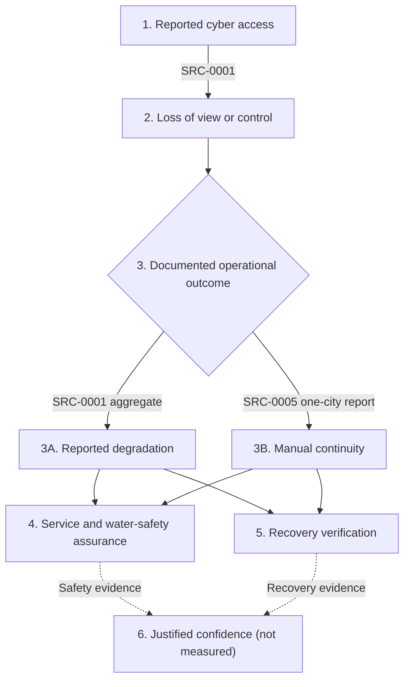

# IDEA-0001 — Drinking-water cyber-resilience consequence path

> Static released exhibit v0.3 — v0.4 evidence-lens enhancement draft; v0.3 remains archived; no live output

## Project metadata

- Idea ID: `IDEA-0001`
- Working project slug: `IDEA-0001-consequence-path`
- Date: 2026-08-17
- Current working status: v0.4 evidence-lens enhancement in development; v0.3 release remains the human-authorized archive
- Version: v0.4-draft (v0.3 release remains PUB-0001)
- Status: released (v0.3 archive); v0.4 enhancement in development
- Visibility: `public_candidate`
- Primary form: source-linked static diagram and evidence-class table; optional website lens
- Intended audience: water-sector operators and leaders, public-health and emergency-management professionals, infrastructure-resilience researchers, and advanced students
- Related source IDs: `SRC-0001`; `SRC-0002`; `SRC-0003`; `SRC-0004`; `SRC-0005`; `SRC-0007`; `SRC-0008`; `SRC-0009`
- Related connection IDs: `CON-0007`; `CON-0009`; `CON-0010`; `CON-0011`; `CON-0012`; `CON-0013`; `CON-0014`
- Related AI contribution IDs: `AI-0009`; `AI-0010`; `AI-0011`; `AI-0012`; `AI-0013`
- Formal-review record: [2026-08-13 review](../../reports/IDEA-0001-consequence-path-formal-review-2026-08-13.md)
- Release-review record: [2026-08-13 release review](../../reports/IDEA-0001-consequence-path-release-review-2026-08-13.md)
- Release record: [PUB-0001 — v0.3 static release](../../published/projects/IDEA-0001-consequence-path-v0.3.md)
- Human decision: repository owner authorized the v0.3 static release on 2026-08-13. The 2026-08-17 evidence-lens enhancement is a draft for review; public web handoff, merge, deployment, and website promotion remain separate

## Editorial proposition

**Question:** How does a reported cyber intrusion relate—or fail to relate—to loss of automation, service continuity, water-safety assurance, recovery, and justified confidence?

**Central insight:** A reported intrusion is not a single outcome. Cyber access, loss of view or control, physical-process effects, continuity, safety assurance, recovery verification, and justified confidence are distinct stages with different evidence requirements.

**Primary user task:** Follow the path from reported cyber access to justified confidence while seeing what the reviewed sources support at each stage and where evidence remains missing.

This prototype does not attribute an actor, report confirmed contamination, diagnose the water sector, evaluate a specific utility's cybersecurity, or claim that one municipality represents other systems.

## Static consequence-path diagram



The branches are analytical, not a universal incident chronology. `SRC-0001` supplies an aggregated multi-state pattern; `SRC-0005` supplies one municipal continuity example. They must not be collapsed into one forensic account. Service and water-safety assurance and recovery verification are parallel evidence questions; neither is established merely because automated communications or control has been restored.

## Source-linked evidence table

| Stage | Evidence class | Decision question | What the reviewed record supports | Source | Evidence scope | What remains unknown or limited |
| --- | --- | --- | --- | --- | --- |
| 1. Reported cyber access | Documented aggregate | What access or configuration change is documented? | FBI and EPA reported remote access to specified internet-facing PLCs and changes to IP addresses and passwords. | [SRC-0001](https://www.fbi.gov/investigate/cyber/alerts/2026/malicious-cyber-actors-targeting-water-and-wastewater-sector-internet--facing-programmable-logic-controllers-causing-operational-disruptions) | Federal aggregate beginning 2026-07-27 | The notice does not identify every facility or attribute the actors. |
| 2. Loss of view or control | Documented aggregate | What operator capability was lost? | The federal notice reports loss of monitoring or control functionality and, in some cases, loss of function of connected equipment. The April joint advisory adds cross-sector reports of HMI disruption, but does not establish the same effect at every water system. | [SRC-0001](https://www.fbi.gov/investigate/cyber/alerts/2026/malicious-cyber-actors-targeting-water-and-wastewater-sector-internet--facing-programmable-logic-controllers-causing-operational-disruptions); [SRC-0002](https://www.epa.gov/newsreleases/epa-fbi-cisa-nsa-issue-joint-cybersecurity-advisory-water-system-regarding-iranian) | Federal aggregate plus a cross-sector advisory | The advisory does not enumerate water-sector victims for every listed technique; PLC function and consequence varied, and the same loss is not established at every site. |
| 3A. Reported degradation | Documented aggregate | Did automation loss produce a physical-process effect? | Reported effects across victims included pressure loss and flooding. The notice says pressure loss could create a potential pathway for untreated groundwater intrusion. | [SRC-0001](https://www.fbi.gov/investigate/cyber/alerts/2026/malicious-cyber-actors-targeting-water-and-wastewater-sector-internet--facing-programmable-logic-controllers-causing-operational-disruptions) | Federal aggregate | The notice does not map each effect to each site and does not report confirmed contamination. |
| 3B. Manual continuity | Documented case | Could service continue when automated communications were disrupted? | Plymouth reported communications disruption, continued operation through manual procedures, and no impact to water levels or water quality. | [SRC-0005](https://www.plymouthmn.gov/Home/Components/News/News/8977/542) | One municipal report | The city notice is not independent forensics and does not establish device model, attribution, or sector-wide effectiveness. |
| 4. Service and water-safety assurance | Bounded synthesis | What evidence supports conclusions about service continuity and safe water? | The sources distinguish potential pathways, reported water-level and water-quality status, and planning obligations. EPA links physical and cyber threats to risk-and-resilience assessments and states that cybersecurity belongs in the assessment baseline for covered community water systems. | [SRC-0001](https://www.fbi.gov/investigate/cyber/alerts/2026/malicious-cyber-actors-targeting-water-and-wastewater-sector-internet--facing-programmable-logic-controllers-causing-operational-disruptions); [SRC-0003](https://www.epa.gov/enforcement/enforcement-alert-drinking-water-systems-address-cybersecurity-vulnerabilities); [SRC-0005](https://www.plymouthmn.gov/Home/Components/News/News/8977/542); [SRC-0008](https://www.epa.gov/cyberwater/cybersecurity-assessments) | Bounded synthesis of federal policy, assessment guidance, and incident reports | Operational restoration is not itself proof of service continuity or water safety; the public record does not provide a common verification dataset across incidents. |
| 5. Recovery verification | Bounded synthesis | What was restored, checked, monitored, and communicated? | FBI and EPA recommend checking configurations and known-good logic, validating backups, reviewing connected devices, and maintaining tested manual capability. Plymouth reported restored communications, normal operations, and continued monitoring. EPA planning guidance links preparation, response, recovery, incident-action checklists, and OT asset-inventory guidance. | [SRC-0001](https://www.fbi.gov/investigate/cyber/alerts/2026/malicious-cyber-actors-targeting-water-and-wastewater-sector-internet--facing-programmable-logic-controllers-causing-operational-disruptions); [SRC-0005](https://www.plymouthmn.gov/Home/Components/News/News/8977/542); [SRC-0009](https://www.epa.gov/cyberwater/cybersecurity-planning) | Federal recommendations, EPA planning guidance, plus one municipal report | Public notices and guidance do not provide a standardized recovery-assurance record or full after-action evidence. |
| 6. Justified confidence | Analytical question | What evidence would justify confidence for operators, regulators, leaders, and the public? | The reviewed sources provide incident, response, planning, monitoring, and communication inputs. MNIT documents a coordinated multiagency response to more than 30 targeted systems, while NIST OT guidance and EPA assessment/planning resources provide framework inputs for reliability, safety, and recovery questions. | [SRC-0003](https://www.epa.gov/enforcement/enforcement-alert-drinking-water-systems-address-cybersecurity-vulnerabilities); [SRC-0004](https://mn.gov/mnit/media/blog/?id=38-761869); [SRC-0005](https://www.plymouthmn.gov/Home/Components/News/News/8977/542); [SRC-0007](https://csrc.nist.gov/pubs/sp/800/82/r3/final); [SRC-0008](https://www.epa.gov/cyberwater/cybersecurity-assessments); [SRC-0009](https://www.epa.gov/cyberwater/cybersecurity-planning) | Analytical question grounded in public records and framework guidance | No reviewed source directly measures trust or proves that confidence was warranted across systems. |

The machine-readable version is [data/path-stages.csv](data/path-stages.csv). The reviewed source snapshot is [data/source-snapshot.csv](data/source-snapshot.csv); the root repository registers remain authoritative. The public example uses the same source-linked snapshot and exposes the evidence class as a bounded reading lens.


## Evidence layers in the v0.4 draft

The enhancement adds evidence without collapsing unlike records:

- **Documented aggregate:** SRC-0001 and SRC-0002 describe federal incident or advisory patterns. They do not identify every facility or prove that every listed technique occurred at every water system.
- **Documented case:** SRC-0004 and SRC-0005 provide dated state and municipal response snapshots. They are not a common forensic dataset.
- **Governance and planning baseline:** SRC-0003, SRC-0008, and SRC-0009 describe EPA enforcement, assessment, planning, response, and recovery resources. Guidance does not prove implementation.
- **OT security framework:** SRC-0007 provides a general NIST frame for reliability, safety, physical-process interaction, and security. It is not incident evidence.
- **Analytical question:** PATH-06 remains a question about what would justify confidence; no source measures confidence directly.

The public example exposes these classes through a progressive-enhancement filter. The complete table remains visible when scripts are unavailable, and the filter does not score, rank, or compare utilities.
## Source boundary and currentness

The draft uses eight registered primary or standards-setting sources: two federal incident/advisory records, EPA enforcement and program guidance, a Minnesota response notice, a Plymouth municipal update, and NIST OT-security guidance. Secondary news reporting is not used as evidence or as a substitute for these records.

- [SRC-0001](https://www.fbi.gov/investigate/cyber/alerts/2026/malicious-cyber-actors-targeting-water-and-wastewater-sector-internet--facing-programmable-logic-controllers-causing-operational-disruptions) — federal water-sector incident pattern.
- [SRC-0002](https://www.epa.gov/newsreleases/epa-fbi-cisa-nsa-issue-joint-cybersecurity-advisory-water-system-regarding-iranian) — cross-sector joint advisory.
- [SRC-0003](https://www.epa.gov/enforcement/enforcement-alert-drinking-water-systems-address-cybersecurity-vulnerabilities) — EPA enforcement and resilience baseline.
- [SRC-0004](https://mn.gov/mnit/media/blog/?id=38-761869) — Minnesota response snapshot.
- [SRC-0005](https://www.plymouthmn.gov/Home/Components/News/News/8977/542) — Plymouth continuity and restoration snapshot.
- [SRC-0007](https://csrc.nist.gov/pubs/sp/800/82/r3/final) — NIST OT-security framework.
- [SRC-0008](https://www.epa.gov/cyberwater/cybersecurity-assessments) — EPA assessment resources and AWIA/SDWA scope.
- [SRC-0009](https://www.epa.gov/cyberwater/cybersecurity-planning) — EPA planning and recovery resources.

- Evidence snapshot date: 2026-08-17.
- `SRC-0001`, `SRC-0003`, and `SRC-0004` were rechecked directly on 2026-08-13; `SRC-0005` was directly reviewed for the register on 2026-08-10 and reconfirmed by official-domain search on 2026-08-13.
- `SRC-0002`, `SRC-0007`, `SRC-0008`, and `SRC-0009` were directly reviewed on 2026-08-17. `SRC-0005` retains its known currentness limitation: automated direct retrieval received HTTP 403, while official-domain review reconfirmed the page title, post date, and displayed claims.
- Event dates, publication dates, page-update dates, and verification dates are not interchangeable.

## Interpretation rules

- Do not state that Plymouth used the PLC models named in `SRC-0001`.
- Do not assign the pressure loss or flooding in the federal aggregate to Plymouth or to every targeted Minnesota system.
- Treat Plymouth's no-impact statement as the city's contemporaneous report, not independent laboratory verification.
- Treat manual operations as a capability whose safety and sustainability depend on context, not as a universal solution.
- Treat justified confidence as an evidence question, not a measured result.
- Keep facility-sensitive configurations, exploitable details, and detailed control-testing methods out of this released static exhibit.

## Interaction decision

No interaction or animation was added to v0.3. The v0.4 draft adds one bounded evidence-class filter to the public example because readers have a real task: distinguish documented records from synthesis and open questions without implying that cases are comparable. The default view shows every row, and the filter does not score evidence or rank sources.

The filter is progressive enhancement only. With scripts unavailable, the complete table remains visible and the evidence classes are printed in the table. Any future scenario or case-comparison control still requires a separate independently documented comparison dataset and human review.

## Release state

Version v0.3 is a human-authorized static release, recorded as `PUB-0001` and archived under [published/projects](../../published/projects/IDEA-0001-consequence-path-v0.3.md). The authoritative Current Events KM repository remains private; this release creates no public repository, live application, deployment, or website feature. The README, evidence table, Mermaid diagram, and CSV snapshots are the complete static fallback.

The source-currentness limitation for `SRC-0005` is disclosed rather than hidden: the official-domain retrieval reconfirmed the page and displayed claims on 2026-08-13, while automated direct retrieval returned HTTP 403. Future versions must recheck the official municipal page before updating the exhibit.

**Release decision:** `AUTHORIZE STATIC RELEASE`.

**AI disclosure:** This project was developed with AI assistance for source organization, evidence classification, analytical framing, drafting, coding, and validation. The human editor reviewed the source boundary, interpretation limits, public-detail considerations, and release decision.

Website promotion on `stephenlewandowski.github.io`, a public handoff, and any later bounded interaction remain separate human-approved changes.

## Validation and reproducibility

Run from this project directory:

```bash
python3 tests/validate_project.py
```

The check verifies CSV structure, stage and source identifiers, source references, evidence classes, dates, HTTPS URLs, the allowlist of approved primary or standards-setting source hosts, source-link consistency on this page, the recorded v0.3 release state, the v0.4 draft marker, and the bounded interaction decision. It does not determine whether an agency statement is true, whether guidance was implemented, or whether the analytical model is substantively valid; those remain human-review questions.

## Accessibility and fallback

- The evidence table is the complete text fallback for the Mermaid diagram.
- Stage numbers and labels carry meaning without color.
- Source links use descriptive registered IDs and remain visible in the table.
- The authoritative project artifact has no executable content. The public example's evidence-class filter is optional progressive enhancement with keyboard labels, visible status text, and the full table as its no-script fallback.
- The rendered GitHub diagram was kept static for release; inspect it again at desktop and narrow widths before any future website handoff or version update.

## Projects-page handoff record

- **Card title:** From cyber access to justified confidence
- **Question:** What evidence connects a water-sector cyber intrusion to operational effects, safe-water assurance, recovery, and justified confidence?
- **Central insight:** Intrusion, automation loss, physical consequence, continuity, safety assurance, recovery, and confidence are separate claims that require separate evidence.
- **Status:** Static released exhibit v0.3; v0.4 evidence-lens enhancement in review; v0.3 released 2026-08-13 and archived in the authoritative repository
- **Deliverables:** source-linked consequence-path diagram, evidence-class table with bounded filter, and downloadable CSV snapshots
- **Thumbnail description:** A branched consequence path separates reported operational degradation from one municipality's manual continuity response before converging on safety assurance, recovery verification, and justified confidence.

The v0.3 static release remains archived in this authoritative private repository. The v0.4 website changes are a reviewable draft only: no merge, deployment, live-output URL, or public release was performed. Any public handoff or website promotion remains a separate human-approved change.
